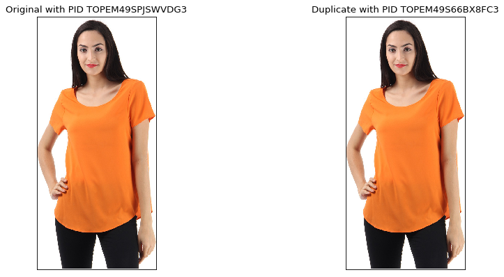
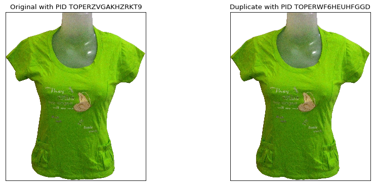
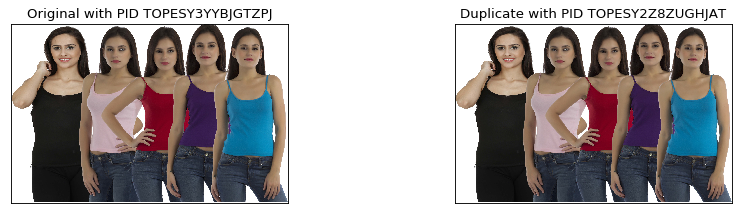
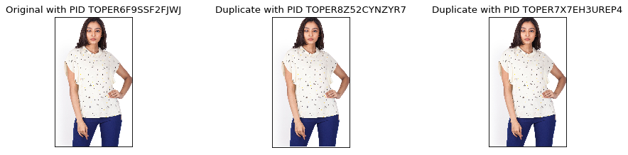

# ICME
Intelligent Catalogue Management for E-Commerce.

- [Problem Statement](#prob-stat)
- [Project Structure](#proj-struc)
- [Preparing dataset](#preparing-dataset)
- [Deduplication Strategies](#dedup-stra)
- [Zeroth law of Deduplication](#zeroth-law)
- [Initial Results](#initial-res)
- [TO-DO](#to-do)
- [License](#license)

<a name="prob-stat"></a>
## 1. Problem Statement
E-commerce companies constantly strive for an efficient catalogue management for better customer experience and inventory management.

A key issue in catalogue management is duplicate product listing. Duplicate listings occur due to couple of reasons, for one, seller could upload the same listings across multiple e-commerce sites and other being the seller uploading the same listings multiple times within a e-commerce site for reasons only known to them.

In this project we focus on this problem of duplicate detection and try to identify an optimal strategy in terms of both **_speed_** and **_accuracy_**.

<a name="proj-struc"></a>
## 2. Project Structure
The project data and codes are arranged in the following manner:
```
icme
  ├── src  
  |   ├── main.py
  |   ├── config.py
  |   ├── huew/       {dataset specific pre-processing techniques}
  |   ├── dedupe/     {different deduplication strategies}
  |   ├── networks/   {architectures used for feature extraction}
  |   └── utils/
  ├── data
  |    ├── 2oq-c1r.zip
  |    ├── tops.csv
  |    ├── refine_tops.csv
  |    ├── images/ {86K+ images of TOPS category}
  |    ├── dedup_sample_submission_file.json  {submission fromat}
  |    ├── duplicates/ {sample results}
  |    ├── pretrained/ {weights for feature ext models}
  |  
```

_Data_: <br>
the `data` folder is not a part of this git project as it was very heavy (30GB+). The same can be downloaded from the [csv file](https://huew.blob.core.windows.net/assignments/2oq-c1r) using this [script](./src/utils/download_ images.py).

`main.py` is the driver file for all processing. The configuration for different experiment runs can be controlled using the `config.py`.

<a name="preparing-dataset"></a>
## 3. Preparing dataset
The dataset given is large __(4057189 data-points with 32 features each)__ keeping in mind the constraints on time and resources available. For algorithm demonstration we are taking a subset of the dataset with product category as **"TOPS"**.

For extracting "TOPS" category from the dataset, we check for all categories that ends with **">TOPS"**. The categories obtained are:
 - Apparels>Women>Western Wear>Shirts, Tops & Tunics>Tops,
 - Apparels>Women>Fusion Wear>Shirts, Tops & Tunics>Tops,
 - Apparels>Women>Maternity Wear>Shirts, Tops & Tunics>Tops,
 - Apparels>Kids>Girls>T-Shirts & Tops>Tops,
 - Apparels>Kids>Infants>Baby Girls>T-Shirts & Tops>Tops

The scripts for extraction can be found [here](./src/huew/pre_process.py)

After `TOPS` extraction 347694 data-points remain (shape: 347694x32).

The `imageUrlStr` had more than one representative image for each product ID (PID). To represent each PID with one image, `imageUrlStr` was split to extract the first link (titled `PrimaryImageUrlStr`).

Some obvious pre-processing techniques included dropping duplicates from some fileds like `productId`, `productUrl`, and `primaryImageUrlStr`.

After this **87968 data-points** remain.

Further each data-point has 32 feature points and all of them do not seem useful. After manual examination, the following features were removed:

``['imageUrlStr','description', 'categories','sellingPrice', 'specialPrice', 'inStock', 'codAvailable', 'offers', 'discount',
                   'shippingCharges', 'deliveryTime', 'sizeUnit','storage', 'displaySize','detailedSpecsStr',
                   'specificationList','sellerName',
                   'sellerAverageRating', 'sellerNoOfRatings', 'sellerNoOfReviews',
                   'sleeve', 'neck', 'idealFor']``

This is done to implement **word2vec** (among other strategies) on the features to identify duplicates.

The final saved file (titled: __refine_tops.csv__) was of shape: **87968x10**

For downloading images from "TOPS" category, the script can be found [here](./src/utils/download_images.py).

<a name="dedup-stra"></a>
## 4. Deduplication strategy
For finding duplicate product listings different strategies have been tried and some are in _to-be tried_ stage.

**1. Image Hashing** <br>
For each image a "difference hash" or dHash is generated based on based on Neal Krawetz's dHash algorithm. The file hashes are then compared. The implementation can be found [here](./src/dedupe/dedupe_dhash.py)

This method seems to be fast when compared to Kmeans or Feature extraction. However, it could identify only the exact duplicates and cannot be used for identifying near duplicate files or files with minimal variation.  

**2. Kmeans using custom distance function** <br>
I tried using K-means with custom distance function. This was inspired by the implementation [here](https://github.com/piyush-kgp/Dedup-detection-in-fashion-images/blob/master/submission/KMeans.py)

Presently Structural Similarity Index (SSI) is used for comparing the distance between vectors. Other possibilities need to be explored. The convergence for cluster definition seems to take a very long time for the 80k+ images.

**3. Feature extraction using CNN framework followed by cosine distance** <br>

For feature extraction using Deep neural networks we adopted the [Squeezenet network](https://arxiv.org/abs/1602.07360) pretrained on [imagenet](https://github.com/rcmalli/keras-squeezenet/releases/download/v1.0/squeezenet_weights_tf_dim_ordering_tf_kernels_notop.h5).

Squeezenet has several advantages over other networks:
 - it is light weight (Model size is less than 5MB)
 - Accuracy is comparable to other heavy architectures like inceptionv3.
 - For the same accuracy of AlexNet, SqueezeNet can be 3 times faster and 500 times smaller.
 - The fire module used is Squeezenet does feature extraction at different resolutions. This takes care of the CNN limitation of not having a global context of the images.

SqueezeNet generates a 512-bit feature vector for each image. First feature for all the images are extracted. Next, in a sorted loop, each image is compared with other remaining images in the loop. So, in a loop of n images, the mth image is compared with (n-m) images.

**4. Haar PSI** <br>
The Haar wavelet-based perceptual similarity index (HaarPSI) is a similarity measure for images that aims to correctly assess the perceptual similarity between two images with respect to a human viewer.

Here local similarity between two images is obtained from high-frequency Haar wavelet filter responses. The similarity values are then passed through a sigmoid function to introduce non-linearity.

The HaarPSI expresses the perceptual similarity of two digital images in the interval [0,1]. For implementation refer [here](https://github.com/rgcda/haarpsi/blob/master/haarPsi.py).


<a name="zeroth-law"></a>
## 5. Zeroth Law of Deduplication
**Search optimisation for deduplication strategy** <br>
I have extended the Zeroth Laws of thermodynamics for the optimisation of deduplication strategy. Lets call it the **Zero Law of Deduplication**

_When we have 3 images: A, B and C. If C is a duplicate of A and B is not a duplicate of C, then B cannot be a duplicate of A_

Following this whenever one image is marked as duplicate in the loop, it is removed from the queue for comparing further images. This reduces the search space for the next images to come.  

<a name="initial-res"></a>
## 6. Initial Results

Some sample results can be seen below:









<a name="to-do"></a>
## 7. To-Do
- [x] Data download and Analysis.
- [x] Data scripts preparation.
- [x] Explore Image Hashing (Partially done).
- [ ] Explore [FAISS](https://github.com/facebookresearch/faiss).
- [ ] Explore Kernelized Locality Sensitive Hashing [(KLSH)](https://github.com/billywan/cs341-duplicate-image-detection).
- [ ] Explore Siamese network (Need to see if that is the optimal solution for this problem).
- [ ] Explore [DELF]((https://github.com/tensorflow/hub/blob/master/examples/colab/tf_hub_delf_module.ipynb) for duplicate detection.
- [ ] Explore word2vec for identifying duplicates.
- [ ] Integration with a database (MongoDB) for faster search results.
- [ ] Integration with a Apache Spark (PySpark) for faster processing.
- [ ] Time and accuracy analysis of different methods for duplication detection.
- [ ] Time analysis to benchmark improvement using Zeroth Law of Deduplication.
